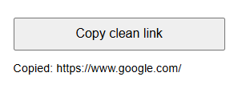

# Clean Link Copier

Copy links without the tracking junk. One click turns this:

`https://www.google.com/?utm_source=facebook&fbclid=abc123``

into this:

`https://www.google.com/`

## Features
- Removes common tracking parameters (utm_*, fbclid, gclid and more)
- Shows you the cleaned link before you paste it
- No data collected. Everything runs in your browser.

## How it works

**Link with tracking junk** – removes it and copies the clean link:

**Link that's already clean** – copies it as is:

**Browser pages like chrome://extensions** – shows a friendly message:

## Install
1. Download this repo (green **Code** button → **Download ZIP**) and unzip it
2. Go to `chrome://extensions` and turn on **Developer mode**
3. Click **Load unpacked** and select the folder

## Contributing
Found a tracking parameter that isn't removed? Open an issue or pull request.

## License
MIT
