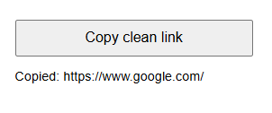
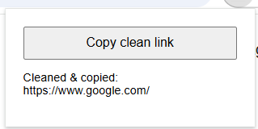
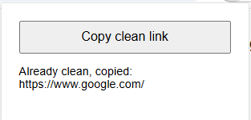
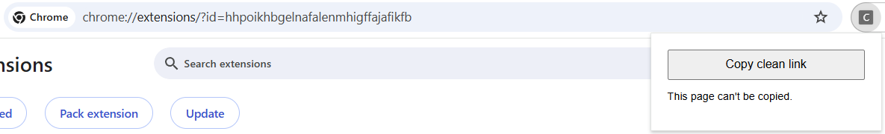

# Clean Link Copier

**Copy any web link without the tracking junk on the end.**

Ever copied a link and noticed it looks like this?

`https://www.google.com/?utm_source=facebook&fbclid=abc123`

All that `?utm_source=...&fbclid=...` at the end is **tracking data**. It quietly tells websites where you found the link. This tiny browser add-on removes it in one click, so you share a clean link:

`https://www.google.com/`

  

---

## ✨ What it does

- **Removes tracking junk** (utm_*, fbclid, gclid and more) from any link
- **Shows you the clean link** before you paste it, so you can see what changed
- **One click** — no menus, no setup
- **Completely private** — no accounts, no tracking, nothing leaves your browser

---

## 🚀 How to install (no technical knowledge needed)

It takes about 2 minutes and works in **Google Chrome**, **Microsoft Edge** and **Brave**.

### Step 1: Download it
1. At the top of this page, click the green **Code** button.
2. Click **Download ZIP**.
3. The file saves to your **Downloads** folder.

### Step 2: Unzip it
1. Open your **Downloads** folder.
2. **Right-click** the downloaded ZIP file and choose **Extract All…**, then click **Extract**.
3. Move the unzipped folder somewhere you won't delete by accident, like your **Documents** folder.

> ⚠️ Don't delete this folder after installing. The browser needs it to stay where it is. If you move it later, you'll need to install again.

### Step 3: Open your browser's extensions page
Copy one of these into your browser's address bar and press **Enter**:

| Browser | Address |
|---|---|
| Google Chrome | `chrome://extensions` |
| Microsoft Edge | `edge://extensions` |
| Brave | `brave://extensions` |

### Step 4: Turn on Developer mode
Find the **Developer mode** switch and turn it **on**. In Chrome and Brave it's in the **top-right corner**; in Edge it's on the **left side**.

> This just lets you install add-ons that aren't from the store. It's safe and doesn't change anything else.

### Step 5: Load the add-on
1. Click **Load unpacked** (it appears after you turn on Developer mode).
2. Select the folder you unzipped in Step 2 (select the folder itself; you don't need to open it).
3. Click **Select Folder**.

**Clean Link Copier** now appears in your list of extensions. 🎉

### Step 6: Pin it to your toolbar
1. Click the **puzzle-piece 🧩** icon at the top right of your browser.
2. Click the **pin 📌** next to Clean Link Copier.

Its icon now stays in your toolbar, ready whenever you need it.

---

## 📋 How to use it

1. Open any web page you want to share.
2. Click the **Clean Link Copier** icon in your toolbar.
3. Click **Copy clean link**.
4. Paste anywhere (Ctrl + V). The tracking junk is gone.

The popup shows you exactly what was copied.

| What you're on | What happens |
|---|---|
| A link with tracking junk | Removes it and copies the clean link |
| A link that's already clean | Copies it as-is and tells you it was already clean |
| A browser page like `chrome://extensions` | Shows a friendly message (these pages can't be copied) |

  
    
  
    
  

---

## ❓ Common questions

**Is it safe?**
Yes. It only reads the address of the page you're on when you click the button, doesn't collect any data, and never connects to the internet. All the code is in this repository for anyone to check.

**What is "tracking junk," exactly?**
Extra bits added to the end of a link (like `?utm_source=` or `&fbclid=`) that tell websites where you came from. Removing them makes the link shorter and more private.

**Why does my browser mention developer mode?**
Some browsers show a note for any add-on not installed from their store. It's normal and safe to dismiss.

**How do I remove it?**
Go to your extensions page (Step 3) and click **Remove** under Clean Link Copier.

---

## 🔒 Privacy & permissions

| Permission | Why it's needed |
|---|---|
| Active tab | To read the current page's link when you click the button |

No data collection, no analytics, no network requests.

---

## 🤝 Contributing

Found a tracking parameter that isn't removed? [Open an issue](https://github.com/vipercipher/clean-link-copier/issues) or a pull request.

---

## 📄 License

[MIT](LICENSE) © Jay
